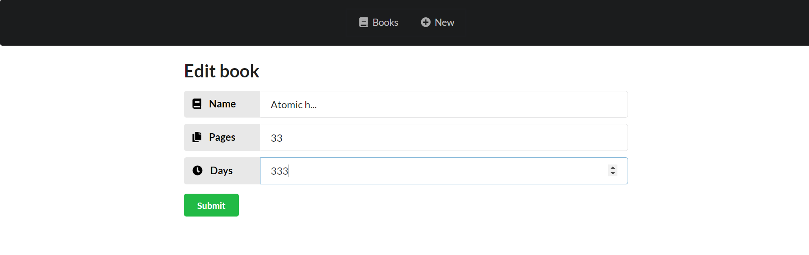

# API LIBRARY - NodeJS and MongoDB Functional Project

## Functional project written in TypeScript to save read books

This project is for you to save books you have already read. You can add, read, update, and delete book information and then storage the data in the database.

-   Easy to save information about books you have already read.
-   You don't need to write any kind of code to add, read, update and delete a book. All the features work on the front-end easily, simply by entering the book data.
-   You can add three types of data to the book: name, number of pages, days read.

## Preview: Interface and features

## Library API usage instructions

1. Clone this project
2. Configure a connection to the dataBase in dbConnection at the end of the index.ts file
3. Install all dependencies to run the project - npm i

## How to tweak this project for your own uses

As this is a working API, I recommend you clone it and add more features to use for your own purposes. It's a good starter boilerplate.

## Find a bug?

If you found an issue or would like to submit an improvement to this project, please submit an issue using the issues tab above. If you would like to submit a PR with a fix, reference the issue you created.
